The sept-embers[^1] of fire dance as the Climbuddy team delivers another update post!

We've used the information from the last post's benchmarks to implement a better segmentation approach using a combination of YOLO detection and SAM segmentation.
In addition, the mesh segmentation is now faster (long live parallelization) and much more accurate due to slight changes to the algorithm. 🎉

Let's dive in!

## App

Same as for the previous update -- all focus is on the model generation pipeline. 🏜️

At the moment, a release date of _10. 2024_ seems unlikely, but we'll see what we can do.

## Tech

### Hold Detection

As discussed in the [previous post](/august-2024-update/), we've done many benchmarks and observations about the YOLO segmentation networks.
These were useful, but experimenting with different datasets showed that the segmentation part of the network _didn't generalize well_ when evaluating images taken with different devices (e.g. phone vs. camera) and different sizes.

However, since the detection part seemed to work rather well, we experimented with using **YOLO's detection networks** for obtaining bounding boxes and using **SAM to generate the segmentation mask.**

The results were pretty great!

<figure class="figures-wrapper">
<div class="figures-container">
  <figure class="center">
    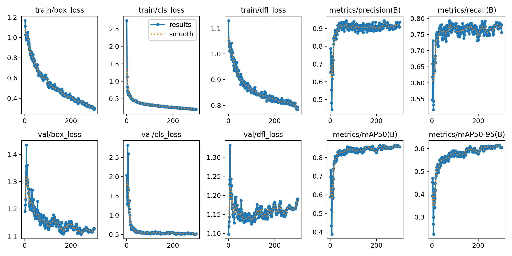
  </figure>
</div>
<figcaption>Training results for the YOLO hold detection network.</figcaption>
</figure>

<figure class="figures-wrapper">
<div class="figures-container">
  <figure class="center">
    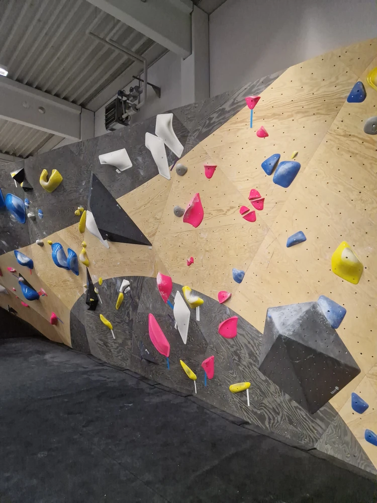
  </figure>

  <figure class="center">
    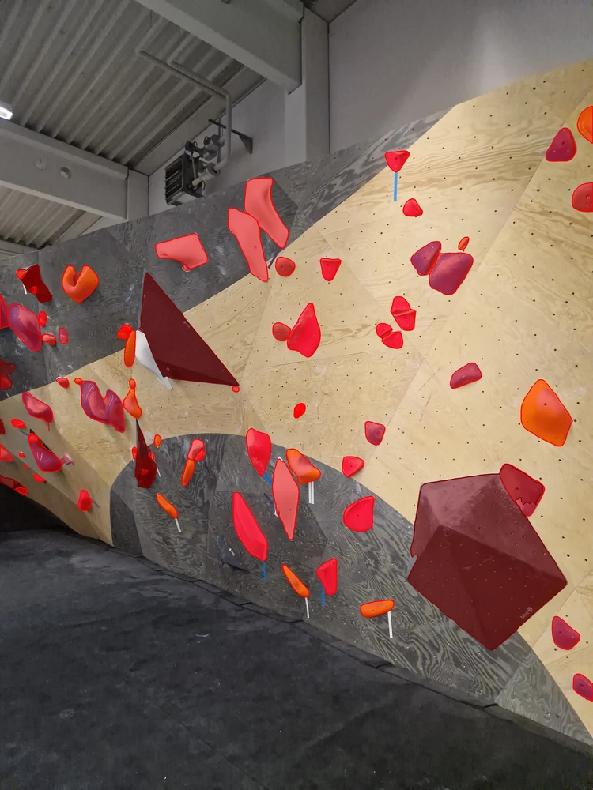
  </figure>


  <figure class="center">
    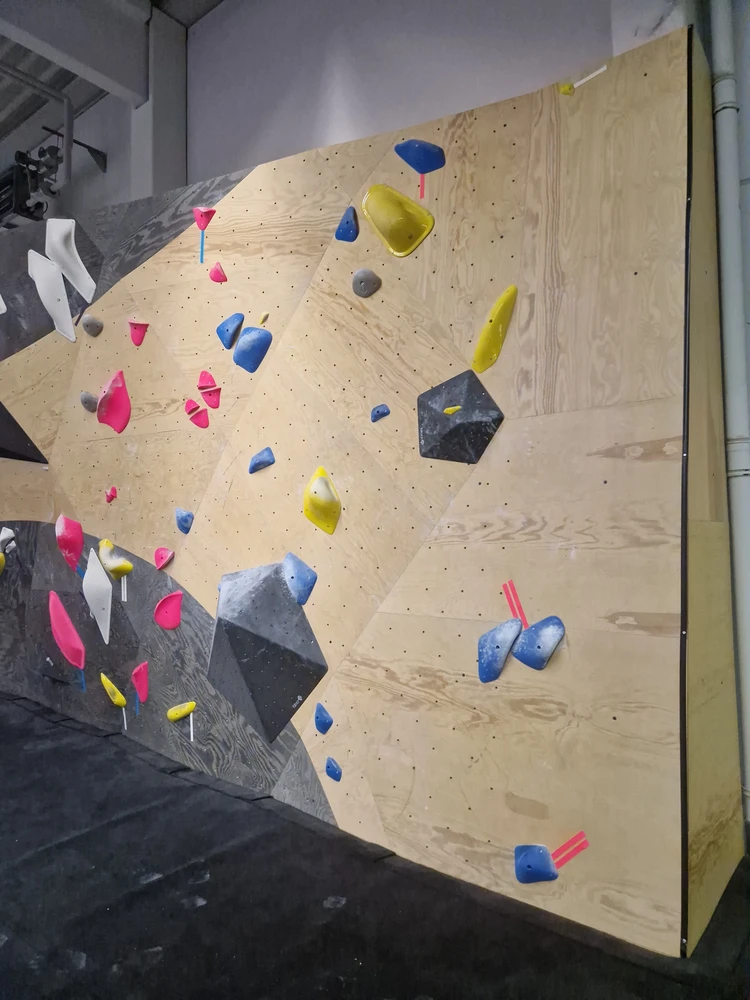
  </figure>

  <figure class="center">
    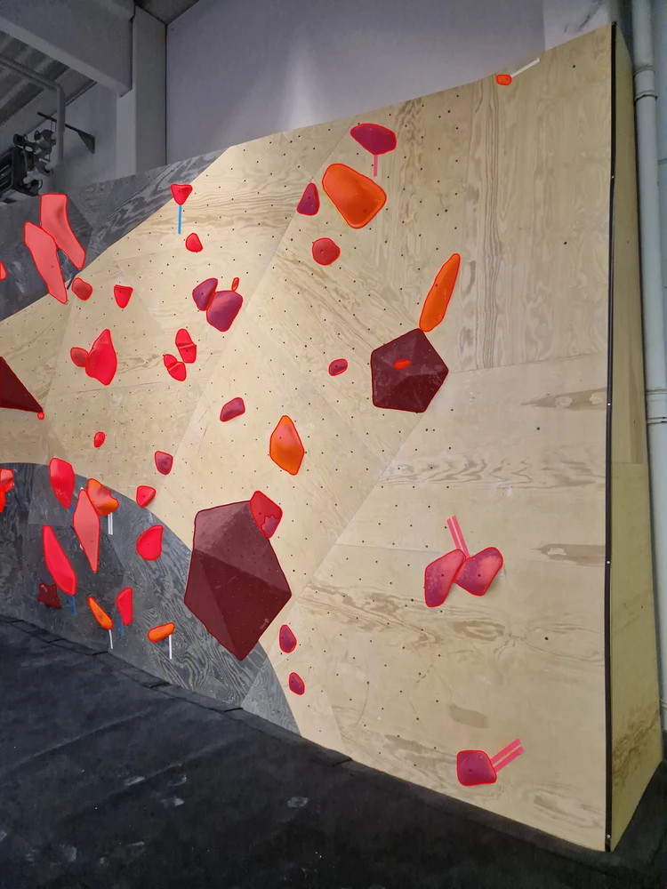
  </figure>
</div>
<div class="figures-container">
  <figure class="center">
    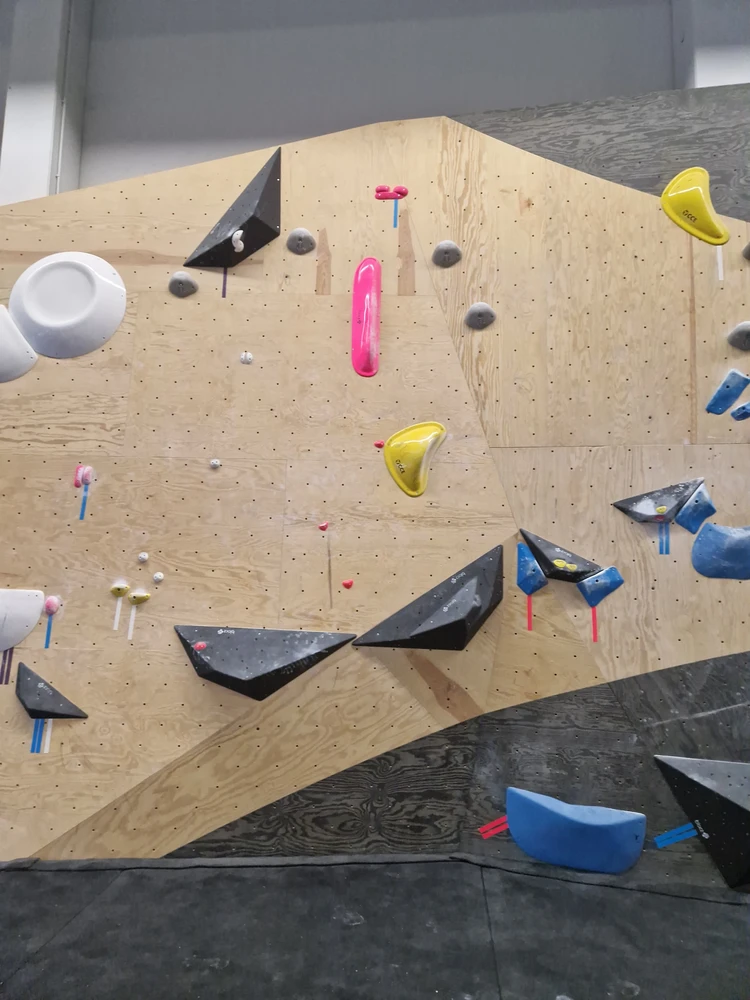
  </figure>

  <figure class="center">
    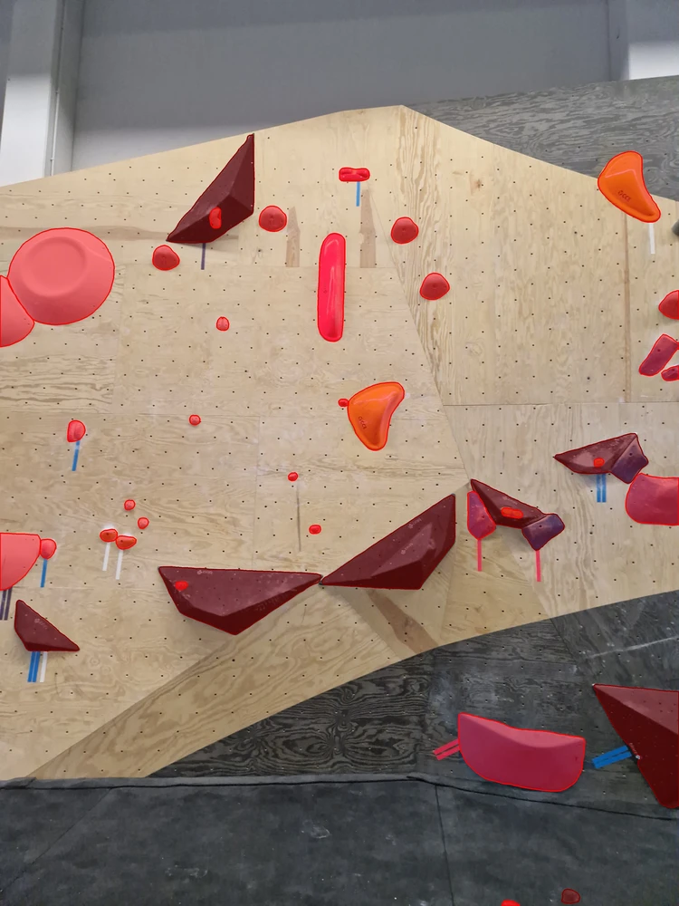
  </figure>


  <figure class="center">
    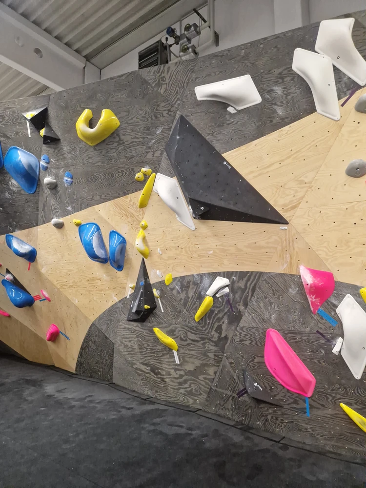
  </figure>

  <figure class="center">
    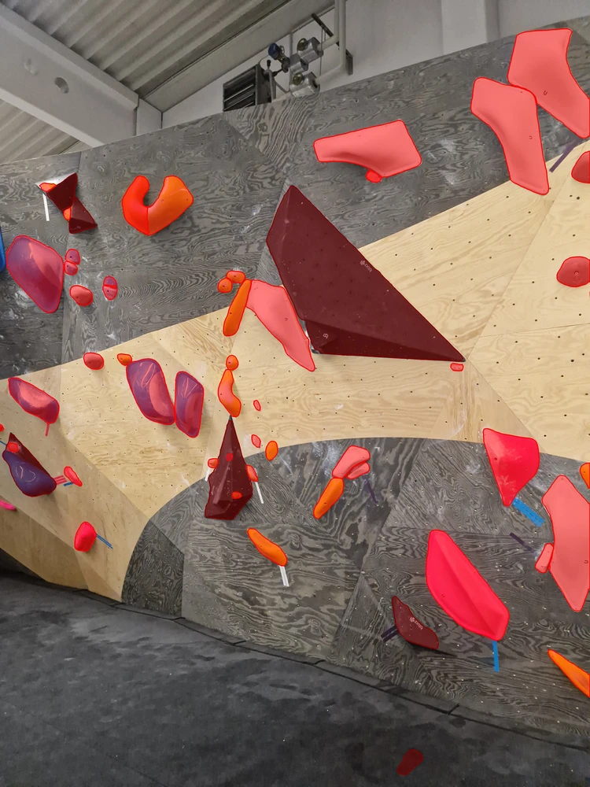
  </figure>
</div>
<figcaption>Image segmentation of new boulders using the YOLO detector + SAM segmentation.</figcaption>
</figure>

When training with images from the initial boulders and evaluating with images from reset boulders, we can see that the network seems to generalize very well, which is reflected in the inference results on the new boulders.

Equipped with these segmentations, we can now perform mesh segmentation.

### Mesh Segmentation

We've refined the mesh segmentation algorithm in a number of ways, including:
- **parallelization** of the projection/raycasting sections
- better **outlier filtering** (when viewing a hold from a large distance)
- better **thresholding** approach (i.e. what triangles actually belong to a hold/volume)

<figure class="figures-wrapper">
<div class="figures-container">
  <figure class="center">
    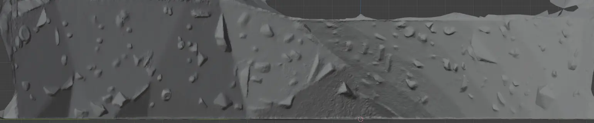
  </figure>
</div>
<div class="figures-container">
  <figure class="center">
    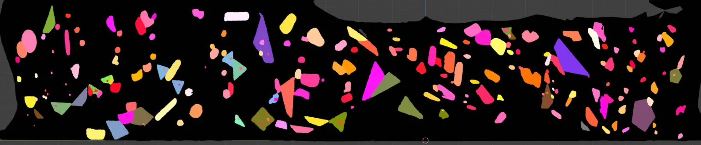
  </figure>
</div>
<div class="figures-container">
  <figure class="center">
    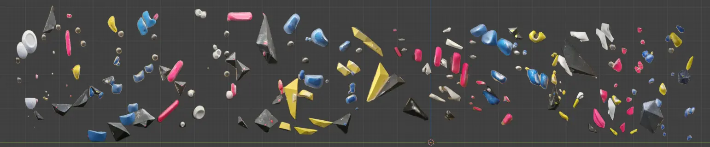
  </figure>
</div>
<figcaption>The mesh segmentation algorithm, step-by-step (raw mesh to textured mesh).</figcaption>
</figure>

While the current results look good, there are many smaller heuristics that we would like to implement before `v1.0` that address certain edge cases, as well as a more comprehensive hyperparameter optimization to make the results not just good, but great 🙂.

### Rewrites

Programming is hard.

When implementing the versions of some of the classes facilitating the image segmentation, it was not easy to decide how to store things like detected objects.
You do have formats like [COCO](https://cocodataset.org/#home) (which we tried to use), but you'll likely end up fighting them more than them actually being useful.

For that reason, we opted for possibly the worst idea -- to store the segmentation masks as numpy arrays, with different values representing the segmentation objects.
While we do use these full segmentation masks in the code, storing them like this runs into many issues:

Firstly, you will likely need to **download more RAM**:

```python
import numpy as np
from sys import getsizeof

mask = np.zeros((1000, 2000, 3))
size = getsizeof(mask)

print(f"{size / 1024 ** 2:.2f} MB")
```

```python
45.78 MB
```

This ties into the second issue -- the segmentation masks are usually sparse, and (at least in our case, modulo some exceptions) the segmented objects have no holes, so we're wasting a lot of memory.
It's generally a much better idea (and some formats do this, I wish I saw them first) to store meaning the **polygons** of the segmented objects.

And so...

```python
24 files changed, 2033 insertions(+), 2677 deletions(-) 🙃
```

... every rewrite is a learning experience.

{: .right}
_Team Climbuddy_

---

[^1]: I couldn't think of a better pun, I'm sorry.
