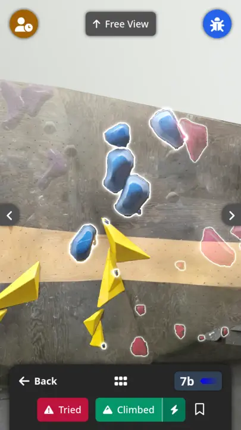
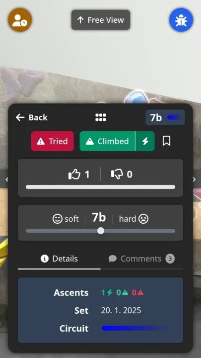
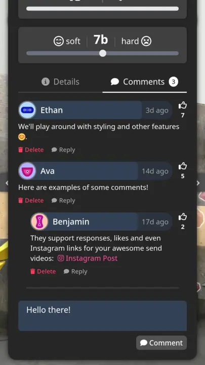
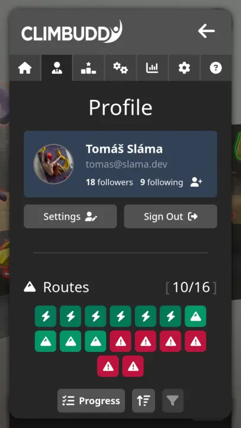
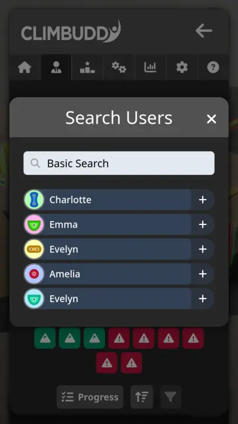
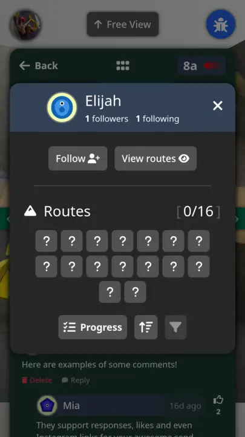
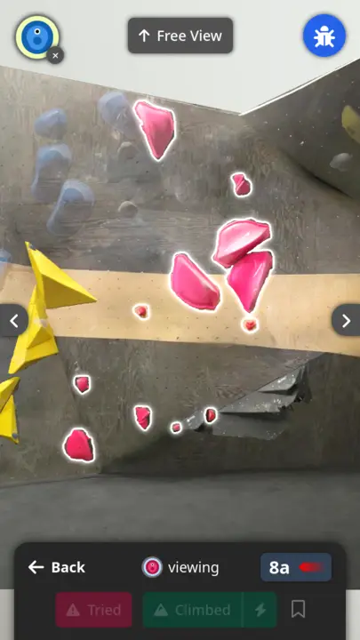

We've officially confirmed that update `0.5` will be Apr-ill 😎 (as in cool, not as in hospitalized).

With the major **Beta release** hurdle overcome, we've gathered a significant amount of feedback about what users like and what they don't like.
We've fixed the minor things and started working on the major things, which can essentially be boiled down to "more social features."

To make the update sizes manageable, we've boiled it down to three main things: **comments**, **followers** and **profiles**.
As these synergize pretty well, we've decided to **include them all** in the next social-focused update, and will be covering how they currently look.

## App

To summarize, we've made significant progress on all of the aforementioned features:
- a [**comment section**](#comments) for each route with **Instagram posts**, which allows users to post their awesome send videos and discuss the route with others via replies and likes,
- a [**followers/following**](#followers--following) section, allowing you to **keep track of what your friends are up** to and look at which routes they sent, adding via _leaderboard/comments/direct search,_ and
- a [**user profiles**](#user-profiles) implementation, which **complement** both of the features above

The following sections cover each of these in turn.

### Comments

Comments are available under **each of the current routes for the wall,** and can be posted by any verified user.
The implementation is **similar to Instagram** -- you can reply, like, delete (your own) and link to Instagram reels/posts.
This allows both the users and the setters, which are marked in a special way, to discuss routes, post their send videos, and more!

<figure class="figures-wrapper">

  <figure class="center">
    
    <figcaption>Comment section (<strong>1</strong>).</figcaption>
  </figure>
  <figure class="center">
    
    <figcaption>Comment section (<strong>2</strong>).</figcaption>
  </figure>
  <figure class="center">
    
    <figcaption>Comment section (<strong>3</strong>).</figcaption>
  </figure>

</figure>

### Followers / Following

The user profile has collected a new section: **followers** and **following!**

At the moment, these function mostly to be able to **access user profiles of the climbers at your home gym,** but they will likely be used to implement a timeline feature of some kind in the future (e.g. Tom has climbed 3 new routes).

Follow for more 😊!

{: .tiny}
Sorry, I had to.

<figure class="figures-wrapper">

  <figure class="center">
    
    <figcaption><strong>Followers/following,</strong> in user profile.</figcaption>
  </figure>
  <figure class="center">
    
    <figcaption><strong>User search</strong> to find followers.</figcaption>
  </figure>

</figure>

### User Profiles

Last but not least, user profiles!

These make both of the features above actually useful, since you can click on users **in the comments / on the leaderboard / using direct search** and see what they're up to.
This obviously only includes public information, **not** things like your email.

<figure class="figures-wrapper">

  <figure class="center">
    
    <figcaption><strong>User profile / progress</strong> of other users.</figcaption>
  </figure>
  <figure class="center">
    
    <figcaption>View routes <strong>as the user</strong>.</figcaption>
  </figure>

</figure>

{: .right}
_Team Climbuddy_
